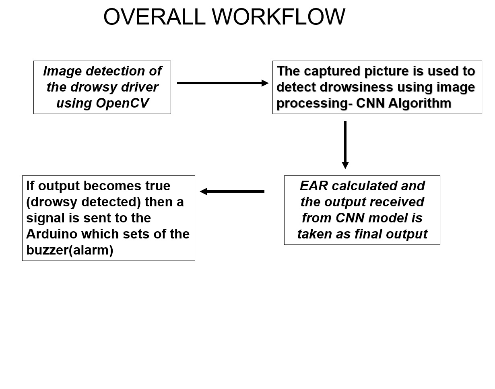

# 💤 Drowsiness Detection System Using OpenCV, CNN, and Arduino

This project aims to detect drowsy drivers using a combination of image processing techniques and machine learning (CNN) and trigger an alarm via an Arduino microcontroller when drowsiness is detected.

---

## 🧠 Overview

The system captures a live image of the driver using a webcam. It applies **OpenCV** for facial feature detection, uses a **Convolutional Neural Network (CNN)** to determine drowsiness, calculates the **Eye Aspect Ratio (EAR)**, and, based on the result, sends a signal to an **Arduino** board to trigger a buzzer alarm.

---

## 🔁 Workflow

1. **Image Detection**  
   Captures live frames of the driver using a webcam with **OpenCV**.

2. **CNN-based Drowsiness Detection**  
   The captured image is fed to a **CNN algorithm** trained to detect closed eyes or sleepy behavior.

3. **EAR Calculation**  
   The **Eye Aspect Ratio (EAR)** is calculated to quantitatively measure eye closure. The CNN output and EAR are used to confirm drowsiness.

4. **Signal to Arduino**  
   If the result confirms drowsiness, a signal is sent to the **Arduino**, which activates a **buzzer (alarm)** to wake the driver.

---

## 📦 Components Used

- Python (OpenCV, MediaPipe, Keras/TensorFlow)
- CNN model trained on eye images
- EAR (Eye Aspect Ratio) formula
- Arduino Uno or Nano
- Buzzer module
- USB Camera

---

